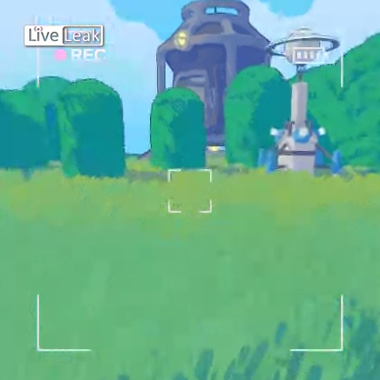
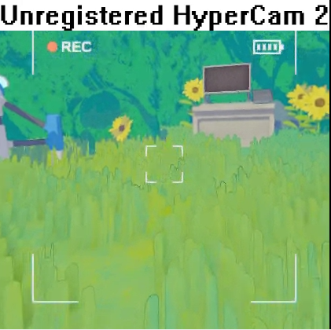
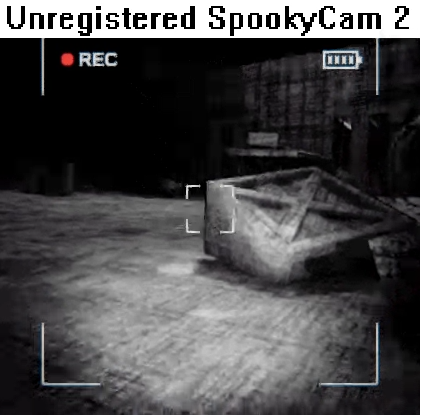
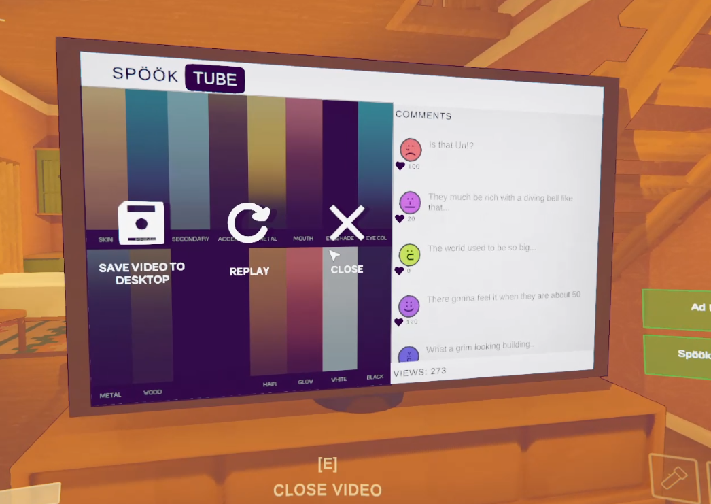

# CW LiveLeak™

### Ever wanted your Content Warning footage looking like its from LiveLeak??

#### Or that your a filthy pirate who can't afford their camera recording?

This mod does just that! By default you have 3 choices

### LiveLeak



### Hypercam



### and its in universe counterpart. SpookyCam!




## Known Bugs

This might happen

idk why just click replay and it fixes itself

## Config

Configs are where you would usually find them

```yaml
## Plugin GUID: CWLiveLeak

[General]

## What Icon is shown, available choices are: liveleak, hypercam, spookycam 
# Setting type: String
# Default value: liveleak
Icon = liveleak
```
not case sensitive
